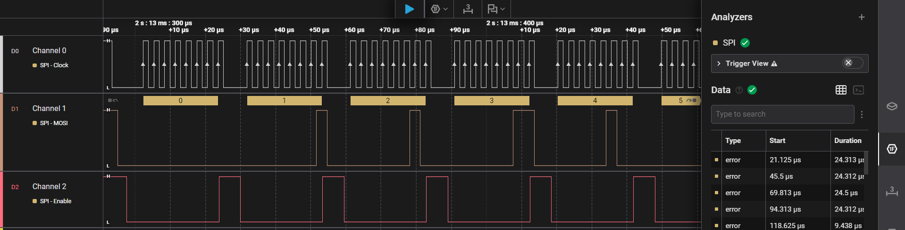
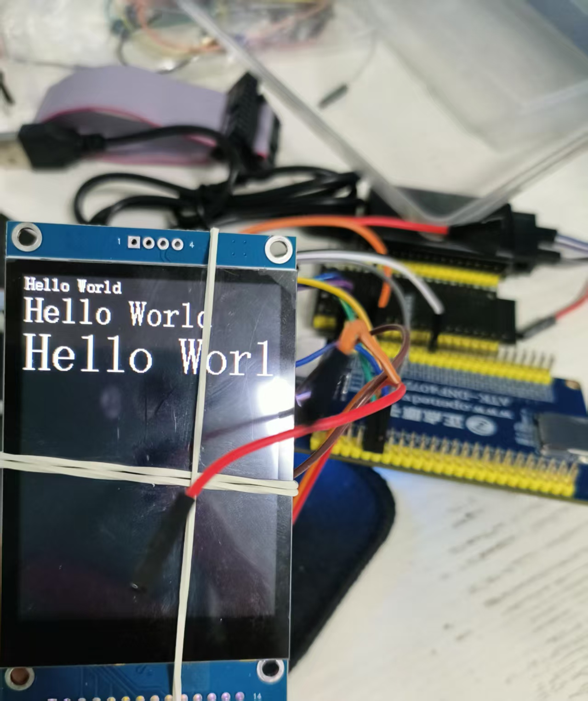

# learning_project
learning for 梅花七月香, 基于FreeRTOS的stm32智能天气时钟

## 4. IIC项目简介

## 📁 核心文件结构 (The Onion Model)

本项目严格遵循“机制与策略分离”的原则，采用经典的洋葱模型分层架构：

```
📁 Project_Root/
│
├── 📁 app/                 # 🏢 业务应用层 & 板级支持包 (BSP)
│   ├── main.c              # 🧠 项目大脑：负责业务逻辑编排，绝不直接操作硬件引脚
│   └── board.c/h           # 🗺️ 硬件配置表：定义引脚连接、时钟初始化与句柄(对象)实例化
│
├── 📁 driver/              # ⚙️ 驱动中轴层 (Middleware - 完全跨平台)
│   ├── *_desc.h            # 🪪 硬件身份证：定义外设属性的结构体模板 (彻底隐藏底层细节)
│   ├── led.c/h             # 💡 LED 驱动：支持高低电平逻辑抽象
│   ├── botton.c/h          # 🔘 按键驱动：实现基于中断的面向对象 Callback 回调
│   ├── i2c.c/h             # 🚏 软件 I2C：开漏自适应输出，严谨的底层的状态机与延时控制
│   ├── at24c02.c/h         # 💾 EEPROM 驱动：支持页写防翻卷，【依赖注入】I2C 总线句柄
│   └── uart.c/h            # 🔌 串口驱动：业务解耦，接管底层实现 printf 完美重定向
│
├── 📁 firmware/            # 🧱 固件库层
│   └── STM32F4xx_StdPeriph # 存放 STM32 官方标准外设库 (直接对接寄存器)
│
└── 📁 mdk/                 # 🛠️ 工程管理层
    └── Keil_Project        # 存放 Keil uVision5 工程文件及编译产物
```

## 5. SPI 项目简介 (针对逻辑分析仪优化)

### 🚀 实验背景

本项目不同于up主的，针对 **24MHz 采样率的入门级逻辑分析仪** 进行了优化。

### 引入 CS 片选信号

由于廉价逻辑分析仪在全速运行时容易出现帧对齐丢失（数据错位），本项目通过手动控制 **PB12 (CS)** 引脚，确保逻辑分析仪能精准识别每一帧的起始。

**硬件接线：**

- **SCK**: PB13 (CH0)
- **MOSI**: PC3 (CH1)
- **CS**: PB12 (CH2) —— 用于逻辑分析仪 Enable 触发

### 📊 调试波形图

> 

## 6.LCD文件夹

本项目严格遵循“机制与策略分离”原则，采用分层架构：

```
📁 Project_Root/
│
├── 📁 app/                 # 🏢 业务应用层 & 板级支持包
│   ├── main.c              # 🧠 项目大脑：负责业务逻辑编排
│   ├── board.c/h           # 🗺️ 硬件配置表：定义引脚连接与时钟初始化
│   └── 📁 font/            # 🔠 字库组件：包含16/32/48等多种字号的点阵数据
│
├── 📁 driver/              # ⚙️ 驱动中轴层 (Middleware)
│   ├── *_desc.h            # 原IIC等驱动的外设属性定义
│   ├── led.c/h             # 💡 LED 抽象层
│   ├── botton.c/h          # 🔘 按键中断及回调逻辑
│   ├── i2c.c/h             # 🚏 软件 I2C 核心协议层
│   ├── spi.c/h             # 🖼️ SPI 驱动 (针对逻辑分析仪片选优化)
│   ├── st7789.c/h          # 🖥️ LCD 屏幕驱动底层 (基于SPI)
│   └── cpu_delay.c/h       # ⏱️ DWT CPU 精确延时实现
│
├── 📁 images/              # 🖼️ 存放文档图片
│   └── image-20260511215212920.png  # SPI 波形截图
│	└── lcd.jpg  # lcd 显示字符
│
├── 📁 firmware/            # 🧱 STM32 官方标准外设固件库
└── 📁 mdk/                 # 🛠️ Keil 工程管理文件
```

### 🚀 实验简介

本项目基于优化后的 SPI 协议，成功驱动了 **ST7789** 控制器的 LCD 屏幕。将底层的画点、填色等“机制”封装在 driver 层，在 app 层实现了丰富的字符渲染“策略”。
文件内容基于SPI项目而来，添加IIC项目driver文件夹，由于仅实现代码的模块化！！！并没有bsp分层，和添加IIC等所需的库文件及头文件

### 注意：文件内容基于SPI项目而来，driver文件夹添加的IIC项目的，仅实现代码的模块化！！！并没有BSP分层和添加IIC等所需的库文件及头文件

### 🖼️ 显示效果实测

> 
